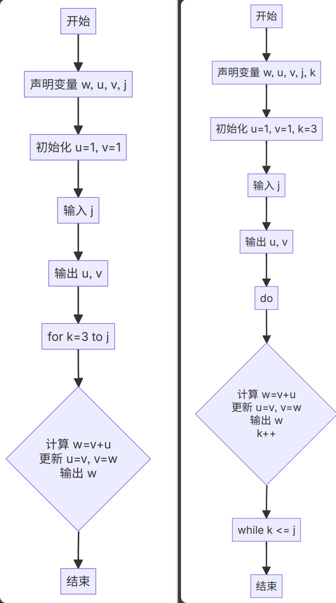

## Q:C语言中如何表示阶乘

在C语言中，阶乘通常使用循环来实现。以下是一个使用for循环计算阶乘的示例代码：

```C
#include <stdio.h>

long long factorial(int n) {
    long long result = 1;
    for (int i = 1; i <= n; i++) {
        result *= i;
    }
    return result;
}

int main() {
    int num;
    printf("请输入一个正整数：");
    scanf("%d", &num);

    if (num < 0) {
        printf("输入的数必须是正整数！\n");
    } else {
        long long fact = factorial(num);
        printf("%d 的阶乘是 %lld\n", num, fact);
    }

    return 0;
}
```

在这个示例中，factorial 函数接受一个整数参数 n，并使用一个for循环从1到 n 遍历，将每个数累乘到 result 变量中，最终返回 result 作为阶乘的结果。在 main 函数中，我们提示用户输入一个正整数，然后调用 factorial 函数计算并输出阶乘结果。如果输入的数不是正整数，程序会输出错误提示信息。

## Q:多维数组是什么，详细解释一下，并告诉我如何用C语言实现

多维数组是指在编程中用于存储多个维度数据的数组。多维数组可以看作是嵌套的数组，每一维都包含一个子数组。常见的多维数组包括二维数组、三维数组等。

### 多维数组的特点
1. **维度**：多维数组有多个维度，每个维度可以有不同的长度。
2. **索引**：访问多维数组中的元素需要使用多个索引，每个索引对应一个维度。
3. **内存布局**：多维数组在内存中是连续存储的，但索引的方式可能会导致非连续的访问。

### 二维数组
二维数组是最常见的多维数组形式，可以看作是一个表格，由行和列组成。一个二维数组可以用两个索引来访问，第一个索引表示行，第二个索引表示列。

#### 声明和初始化
```C
// 声明一个2x3的二维数组
int array[2][3];

// 初始化二维数组
int array[2][3] = {
    {1, 2, 3},
    {4, 5, 6}
};
```

#### 访问元素
```C
// 访问第一个行的第一个列的元素
int element = array[0][0];

// 修改第一个行的第一个列的元素
array[0][0] = 10;
```

### 三维数组
三维数组可以看作是一个立方体，由层、行和列组成。一个三维数组可以用三个索引来访问，第一个索引表示层，第二个索引表示行，第三个索引表示列。

#### 声明和初始化
```C
// 声明一个2x3x4的三维数组
int array[2][3][4];

// 初始化三维数组
int array[2][3][4] = {
    {
        {1, 2, 3, 4},
        {5, 6, 7, 8},
        {9, 10, 11, 12}
    },
    {
        {13, 14, 15, 16},
        {17, 18, 19, 20},
        {21, 22, 23, 24}
    }
};
```

#### 访问元素
```C
// 访问第一个层的第一个行的第一个列的元素
int element = array[0][0][0];

// 修改第一个层的第一个行的第一个列的元素
array[0][0][0] = 10;
```

### 多维数组的应用
多维数组在实际编程中有很多应用，例如：

+ **图像处理**：可以使用二维数组来表示图像的像素值。
+ **三维模型**：可以使用三维数组来表示物体的顶点和面。
+ **表格数据**：可以使用二维数组来存储和操作表格数据。

### 总结
多维数组是编程中用于存储多个维度数据的数据结构。常见的多维数组包括二维数组和三维数组。通过理解多维数组的特点和如何访问其元素，可以在实际编程中更高效地处理复杂数  
据。

## Q:用C语言生成杨辉三角的两种方法（两个数组和一个数组）并举例

方法一：使用两个数组

```C
#include <stdio.h>

#define ROWS 10

int main() {
    int triangle[ROWS][ROWS];
    int i, j;

    // 初始化第一列和对角线为1
    for (i = 0; i < ROWS; i++) {
        triangle[i][0] = 1;
        triangle[i][i] = 1;
    }

    // 计算其他位置的值
    for (i = 2; i < ROWS; i++) {
        for (j = 1; j < i; j++) {
            triangle[i][j] = triangle[i - 1][j - 1] + triangle[i - 1][j];
        }
    }

    // 打印杨辉三角
    for (i = 0; i < ROWS; i++) {
        for (j = 0; j <= i; j++) {
            printf("%d ", triangle[i][j]);
        }
        printf("\n");
    }

    return 0;
}
```

方法二：使用一个数组

```C
#include <stdio.h>

#define ROWS 10

int main() {
    int triangle[ROWS];
    int i, j;

    // 初始化第一行为1
    triangle[0] = 1;

    // 打印第一行
    printf("%d\n", triangle[0]);

    // 计算并打印其他行
    for (i = 1; i < ROWS; i++) {
        triangle[i] = 1;
        for (j = i - 1; j > 0; j--) {
            triangle[j] += triangle[j - 1];
        }
        for (j = 0; j <= i; j++) {
            printf("%d ", triangle[j]);
        }
        printf("\n");
    }

    return 0;
}
```

这两种方法都可以生成杨辉三角，你可以根据自己的需求选择使用哪种方法。

## Q:如何利用这两种方法输出金字塔形的杨辉三角

要输出金字塔形的杨辉三角，我们可以在上述两种方法的基础上进行修改，主要是调整打印格式。以下是修改后的代码：

方法一：使用两个数组

```C
#include <stdio.h>

#define ROWS 10

int main() {
    int triangle[ROWS][ROWS];
    int i, j;

    // 初始化第一列和对角线为1
    for (i = 0; i < ROWS; i++) {
        triangle[i][0] = 1;
        triangle[i][i] = 1;
    }

    // 计算其他位置的值
    for (i = 2; i < ROWS; i++) {
        for (j = 1; j < i; j++) {
            triangle[i][j] = triangle[i - 1][j - 1] + triangle[i - 1][j];
        }
    }

    // 打印金字塔形杨辉三角
    for (i = 0; i < ROWS; i++) {
        // 打印空格，形成金字塔形状
        for (j = 0; j < ROWS - i - 1; j++) {
            printf(" ");
        }
        for (j = 0; j <= i; j++) {
            printf("%d ", triangle[i][j]);
        }
        printf("\n");
    }

    return 0;
}
```

方法二：使用一个数组

```C
#include <stdio.h>

#define ROWS 10

int main() {
    int triangle[ROWS];
    int i, j;

    // 初始化第一行为1
    triangle[0] = 1;

    // 打印第一行
    printf(" "); // 打印一个空格，使金字塔形状更明显
    printf("%d\n", triangle[0]);

    // 计算并打印其他行
    for (i = 1; i < ROWS; i++) {
        triangle[i] = 1;
        for (j = i - 1; j > 0; j--) {
            triangle[j] += triangle[j - 1];
        }
        // 打印空格，形成金字塔形状
        for (j = 0; j < ROWS - i - 1; j++) {
            printf(" ");
        }
        for (j = 0; j <= i; j++) {
            printf("%d ", triangle[j]);
        }
        printf("\n");
    }

    return 0;
}
```

这两种方法都会输出金字塔形的杨辉三角。方法一是使用二维数组来存储杨辉三角的每一行，而方法二则是使用一维数组来存储当前行的值，并通过计算得到下一行的值。

## Q:C语言中do......while......循环是干什么的

在C语言中，do...while循环是一种先执行循环体，然后再判断循环条件的循环结构。它的基本语法如下：

```C
do {
    // 循环体语句
} while (条件表达式);
```

do...while循环的执行过程如下：

+ 执行do后面的循环体语句。
+ 计算while后面的条件表达式。
+ 如果条件表达式的值为真（非零），则返回步骤1继续执行循环体；
+ 如果条件表达式的值为假（零），则循环结束。

与while循环不同的是，do...while循环的循环体至少会执行一次，即使条件表达式在第一次判断时就为假。这是因为do...while循环是先执行循环体，然后再判断条件。

例如，下面的代码使用do...while循环来计算用户输入的数字之和，直到用户输入负数为止：

```C
#include <stdio.h>

int main() {
    int num, sum = 0;

    do {
        printf("请输入一个数字（输入负数结束）：");
        scanf("%d", &num);
        sum += num;
    } while (num >= 0);

    printf("输入的数字之和为：%d\n", sum);

    return 0;
}
```

在这个例子中，do...while循环会先执行循环体，要求用户输入一个数字，并将其累加到sum变量中。然后判断num是否小于0，如果不是，则继续执行循环体；如果是，则循环结束。

## Q:打印斐波那契数列的两种方法



```C
#include <stdio.h>
int main()
{
    unsigned long long w, u = 1, v = 1, j;
    scanf("%12llu", &j);
    printf("%12llu %12llu", u, v);
    for(int k = 3; k <= j; k++){
        w = v + u;
        u = v;
        v = w;
        printf(" %12llu",w);
    }
    
}
```
Another solution:
```C
#include <stdio.h>
int main()
{
    int k = 3;
    do
    {
        k++;
        w = u + v;
        u = v;
        v = w;
        printf(" %12llu",w);
    } while (k <= j);
}
```
## Q:C语言中if循环、while循环和do...while循环的区别

在C语言中，`if语句`、`while循环`和`do...while循环`是用于控制程序流程的不同结构。它们之间的主要区别在于执行条件判断的时机和循环体执行的次数。

### 1. if语句
`if语句`用于根据一个条件来决定是否执行某个代码块。  
它只执行一次条件判断，如果条件为真，则执行相应的代码块；如果条件为假，则不执行。  
**语法：**

```C
if (条件表达式) {
    代码块
}
```

### 2. while循环
`while循环`用于在条件为真时重复执行一个代码块。  
它先进行条件判断，如果条件为真，则执行循环体，然后再次进行条件判断，以此类推，直到条件为假时退出循环。  
**语法：**

```C
while (条件表达式) {
    代码块
}
```

### 3. do...while循环
`do...while循环`也用于在条件为真时重复执行一个代码块。  
它与`while循环`的不同之处在于，它先执行一次循环体，然后再进行条件判断。因此，`do...while循环`的循环体至少会执行一次。  
**语法：**

```C
do {
    代码块
} while (条件表达式);
```

### 区别总结
+ **执行顺序：**
    - `if语句`：先判断条件，再执行代码块（执行0次或1次）。
    - `while循环`：先判断条件，再执行代码块（执行0次或多次）。
    - `do...while循环`：先执行代码块，再判断条件（执行1次或多次）。
+ **循环体执行次数：**
    - `if语句`：执行0次或1次。
    - `while循环`：执行0次或多次。
    - `do...while循环`：执行1次或多次。
+ **条件判断时机：**
    - `if语句`和`while循环`：在循环体执行之前判断条件。
    - `do...while循环`：在循环体执行之后判断条件。

根据具体的需求，选择合适的控制结构可以使代码更加清晰和高效。

C语言中如果我定义了一个数组i[5][6][9][7][10]，那么i[3][5][7]是什么意思，并举个例子

在C语言中，如果你定义了一个五维数组i[5][6][9][7][10]，那么i[3][5][7]指的是这个五维数组中的一个特定元素。具体来说，它是在第一维上取索引为3，第二维上取索引为5，第三维上取索引为7的元素。

五维数组可以看作是一个由多个四维数组组成的数组，每个四维数组又由多个三维数组组成，以此类推。因此，i[3][5][7]实际上是访问了这个数组中的一个三维数组。

为了更清楚地理解，我们可以将这个五维数组想象成一个五层的立方体，每一层都有6x9x7x10个元素。i[3][5][7]就是在这个立方体的第四层（因为索引从0开始），第五行（因为索引从0开始），第八列（因为索引从0开始）的那个元素。

请注意，C语言中的数组索引是从0开始的，这意味着第一个元素的索引是0，而不是1。因此，i[3][5][7]实际上是访问了这个数组中的第4个、第6个和第8个元素（在各自的维度上）。  
C

```C
#include <stdio.h>

int main() {
    // 定义一个五维数组
    int i[5][6][9][7][10];

    // 初始化数组元素
    for (int a = 0; a < 5; a++) {
        for (int b = 0; b < 6; b++) {
            for (int c = 0; c < 9; c++) {
                for (int d = 0; d < 7; d++) {
                    for (int e = 0; e < 10; e++) {
                        i[a][b][c][d][e] = a * 1000 + b * 100 + c * 10 + d * 1 + e;
                    }
                }
            }
        }
    }

    // 打印特定元素的值
    printf("The value of i[3][5][7] is: %d\n", i[3][5][7]);

    return 0;
}
```

在这个例子中，我们定义了一个五维数组i，并使用五个嵌套的循环来初始化数组中的每个元素。每个元素的值是通过将其索引值组合而成的。然后，我们打印出i[3][5][7]的值，这是数组中第四层、第五行、第八列的元素的值。

运行这段代码，你会看到输出结果为：

```C
The value of i[3][5][7] is: 3570
```

这个结果符合我们的预期，因为i[3][5][7]的值是由索引值3、5、7组合而成的，即3570。

## Q:前置自增（++i）和后置自增（i++）有什么区别？

1. 运算顺序
+ 前置自增（++i）
    - 先将变量 i 的值加 1，然后再使用 i 的值进行表达式的计算。例如：

```C
    int i = 5;
    int a = ++i;
```

+ 在这里，首先 i 的值变为 6，然后将 6 赋值给 a，所以 a 的值为 6，i 的值也为 6。
+ 后置自增（i++）
    - 先使用变量 i 的值进行表达式的计算，然后再将 i 的值加 1。例如：

```C
    int i = 5;
    int a = i++;
```

+ 首先将 i 的当前值 5 赋值给 a，然后 i 的值变为 6。所以 a 的值为 5，i 的值为 6。


2. 返回值不同
+ 前置自增（++i）
    - 前置自增表达式的值是自增后变量的值。例如在int a = ++i;中，++i 返回的是 i 自增后的值。
+ 后置自增（i++）
    - 后置自增表达式的值是变量自增前的值。例如在int a = i++;中，i++ 返回的是 i 自增前的值。


3. 在表达式中的应用差异
+ 前置自增（++i）
    - 如果在一个复杂表达式中使用前置自增，变量会先自增，再参与表达式运算。例如：

```C
    int i = 5;
    int a = (++i) * 2;
```

+ 首先 i 变为 6，然后 6 * 2 的结果 12 赋值给 a。
+ 后置自增（i++）
    - 在复杂表达式中使用后置自增时，变量先参与表达式运算，然后自增。例如：

```C
    int i = 5;
    int a = (i++) * 2;
```

+ 首先 5 * 2 的结果 10 赋值给 a，然后 i 变为 6。


4. 效率方面（在某些情况下）
+ 前置自增（++i）
    - 对于用户自定义类型（如结构体等），前置自增通常更高效。因为前置自增只需要对变量进行一次操作（先自增再返回）。
+ 后置自增（i++）
    - 对于用户自定义类型，后置自增相对效率较低。因为它需要先保存变量的原始值用于返回，然后再对变量进行自增操作，涉及更多的步骤。不过对于基本数据类型，现代编译器通常会进行优化，这种效率差异往往可以忽略不计。


## C语言中各种排序
### 1.直接选择排序
```C
#include <stdio.h>
#define m 10
int main()
{
    int i, j, k, r, a[m];
    printf("please input achievement:\n");
    for (i = 0; i < m; i++)
    {
        scanf("%d", &a[i]);
    }
    for (i = 0; i < m - 1; i++)
    {
        j = i;
        for (k = i + 1; k < m; k++)
        {
            if (a[k] < a[j])
            {
                j = k;
            }
        }
        r = a[i];
        a[i] = a[j];
        a[j] = r;
    }
    printf("answer:\n");
    for (i = 0; i < m; i++)
    {
        if (i % 10 == 0)
        {
            printf("\n");
        }
        printf("%6d", a[i]);
    }
    printf("\n");
    return 0;
}
```

#### 1.1进阶版
```C
#include <stdio.h>

// 排序函数，采用选择排序的变种
void Sort(int a[], int len) {
    int min, max, temp, i, j; // 声明必要的变量
    // 循环直到中间位置
    for (i = 0; i < len / 2; i++) {
        min = i; // 假设当前最小值的索引为i
        max = i; // 假设当前最大值的索引为i
        
        // 寻找当前未排序部分的最小值和最大值
        for (j = i + 1; j <= len - 1 - i; j++) {
            // 如果找到更小的值，更新min的索引
            if (a[j] < a[min]) min = j;
            // 如果找到更大的值，更新max的索引
            else if (a[j] > a[max]) max = j;
        }
        
        // 如果找到的最小值不在当前位置i，交换位置
        if (min != i) {
            temp = a[i];
            a[i] = a[min];
            a[min] = temp;
        }
        
        // 如果最大值的索引仍为i，则更新为最小值的索引
        if (max == i) max = min;

        // 如果找到的最大值不在当前位置的对称位置，交换位置
        if (max != len - 1 - i) {
            temp = a[len - 1 - i];
            a[len - 1 - i] = a[max];
            a[max] = temp;
        }
    }
}

int main() {
    int a[10]; // 定义一个大小为10的数组
    // 输入10个整数
    for (int i = 0; i < 10; i++) {
        scanf("%d", &a[i]);
    }
    
    int len = sizeof(a) / sizeof(a[0]); // 计算数组的长度

    // 调用排序函数进行排序
    Sort(a, len);

    // 输出排序后的数组
    for (int i = 0; i < len; i++) {
        printf("%d ", a[i]);
    }
    printf("\n"); // 换行

    return 0; // 程序结束返回0
}

```

### 2.冒泡排序
```C
#include <stdio.h>
void bubblesort(int a[], int len)
{
    for (int i = 0; i < len; i++)
    {
        for (int j = 0; j < len - 1; j++)
        {
            if (a[j] > a[j + 1])
            {
                int tmp = a[j];
                a[j] = a[j + 1];
                a[j + 1] = tmp;
            }
        }
    }
}

int main()
{
    int len, i;
    scanf("%d", &len);
    int s[len];
    for (i = 0; i < len; i++)
    {
        scanf("%d", &s[i]);
    }
    bubblesort(s, len);
    printf("answer:\n");
    for (i = 0; i < len; i++)
    {
        if (i % 5 == 0 && i != 0)
        {
            printf("\n");
        }
        printf("%3d", s[i]);
    }
    printf("\n");
    return 0;
}
```

or......

```C
#include <stdio.h>
#include <stdbool.h>
void bubblesort(int s[], int len)
{
    int i, r;
    bool flag;
    flag = true;
    while (flag)
    {
        flag = false;
        for (i = 0; i < len - 1; i++)
        {
            if (s[i] > s[i + 1])
            {
                r = s[i];
                s[i] = s[i + 1];
                s[i + 1] = r;
                flag = true;
            }
        }
    }
}
int main()
{
    int len, i;
    scanf("%d", &len);
    int s[len];
    for (i = 0; i < len; i++)
    {
        scanf("%d", &s[i]);
    }
    bubblesort(s, len);
    printf("answer:\n");
    for (i = 0; i < len; i++)
    {
        if (i % 5 == 0 && i != 0)
        {
            printf("\n");
        }
        printf("%3d", s[i]);
    }
    printf("\n");
    return 0;
}
```

### 3.直接插入排序
基本步骤：

+ 首先，将数组中的第一个元素看作是一个初始的有序序列（长度为 1）。
+ 然后，从第二个元素开始（即对于未排序数据），依次取出每个元素。
+ 对于取出的每个未排序元素，在已有的有序序列中从后向前进行扫描比较。
+ 如果该未排序元素小于已排序序列中的当前比较元素，就将已排序序列中的当前比较元素向后移动一位。
+ 持续这个比较和移动的过程，直到找到合适的位置，将未排序元素插入到该位置，使得插入后新的序列依然有序。  
代码:

```C
#include <stdio.h>

void sort(int n, int a[])
{
    int i, j, k, r;
    for (i = 1; i < n; i++)
    {
        j = i - 1;
        while ((a[j] > a[i]) && (j >= 0))
        {
            j = j - 1;
        }
        r = a[i];
        for (k = i - 1; k >= j + 1; k--)
        {
            a[k + 1] = a[k];
        }
        a[j + 1] = r;
    }
}

int main()
{
    int len, i;
    scanf("%d", &len);
    int s[len];
    for (i = 0; i < len; i++)
    {
        scanf("%d", &s[i]);
    }
    sort(len, s);
    printf("answer:\n");
    for (i = 0; i < len; i++)
    {
        if (i % 5 == 0 && i != 0)
        {
            printf("\n");
        }
        printf("%3d", s[i]);
    }
    printf("\n");
    return 0;
}
```

### 4.归并排序
#### 基本概念
归并排序（Merge Sort）是建立在归并操作上的一种有效的排序算法。该算法是采用分治法（Divide - and - Conquer）的一个非常典型的应用。

#### 原理
##### 分治思想
+ 分解：将一个长度为 n 的数组分成两个长度大致为 n/2 的子数组，然后对每个子数组继续分解，直到子数组的长度为 1。
+ 合并：将两个或多个已经有序的子数组合并成一个有序数组。从最小的子数组开始，逐步合并成较大的有序数组，最终得到一个完全有序的数组。

##### 合并过程
+ 假设要合并两个有序子数组 A 和 B（分别记为 A = [a1, a2, …, am] 和 B = [b1, b2, …, bn]），创建一个临时数组 C 来存储合并后的结果。
+ 比较 A 和 B 的第一个元素，将较小的元素放入 C 中。如果 A 的第一个元素较小，就将 a1 放入 C 中，然后考虑 A 中的下一个元素 a2；如果 B 的第一个元素较小，就将 b1 放入 C 中，然后考虑 B 中的下一个元素 b2。
+ 重复这个比较和放入的过程，直到 A 或 B 中的所有元素都被放入 C 中。
+ 如果 A 中还有剩余元素，将它们全部放入 C 中；如果 B 中还有剩余元素，也将它们全部放入 C 中。


```C
#include <stdio.h>

void merge(int arr[], int tmp[], int left, int mid, int right)
{
    int i, j, t;
    for (i = left, j = mid + 1, t = left; i <= mid && j <= right; t++)
    {
        if (arr[i] <= arr[j])
        {
            tmp[t] = arr[i], i++;
        }
        else
        {
            tmp[t] = arr[j], j++;
        }
    }
    for (; i <= mid; i++)
    {
        tmp[t] = arr[i];
        t++;
    }
    for (; j <= right; j++)
    {
        tmp[t++] = arr[j];
        t++;
    }
    for (t = left; t <= right; t++)
    {
        arr[t] = tmp[t];
    }
}

void msort(int arr[], int tmp[], int left, int right)
{
    int mid;
    if (left != right)
    {
        mid = (left + right) / 2;
        msort(arr, tmp, left, mid);
        msort(arr, tmp, mid + 1, right);
        merge(arr, tmp, left, mid, right);
    }
}

void mergesort(int arr[], int len)
{
    int tmp[len];
    msort(arr, tmp, 0, len - 1);
}

int main()
{
    int len, i;
    scanf("%d", &len);
    int s[len];
    for (i = 0; i < len; i++)
    {
        scanf("%d", &s[i]);
    }
    mergesort(s, len);
    printf("answer:\n");
    for (i = 0; i < len; i++)
    {
        if (i % 5 == 0 && i != 0)
        {
            printf("\n");
        }
        printf("%3d", s[i]);
    }
    printf("\n");
    return 0;
}
```

## Q 在C语言中*ptr++和(*ptr)++有区别吗
在 C 语言中，`*ptr++`和`(*ptr)++`有区别。

1. `*ptr++`：
    - 这个表达式的作用是先取`*ptr`的值，然后将指针`ptr`向后移动一位（指向下一个存储单元）。
    - 例如，如果`ptr`指向一个整数数组，假设初始时`ptr`指向数组的第一个元素，执行`*ptr++`后，会得到第一个元素的值，并且`ptr`指向数组的第二个元素。
2. `(*ptr)++`：
    - 这个表达式是先取指针`ptr`所指向的内容，然后将这个内容的值加 1。
    - 例如，如果`ptr`指向一个整数，执行`(*ptr)++`后，`ptr`所指向的整数的值会增加 1。

以下是一段 C 语言代码示例，演示`*ptr++`和`(*ptr)++`的不同用法：

```C
#include <stdio.h>

int main() {
    int arr[] = {10, 20, 30};
    int *ptr = arr;

    // 演示 *ptr++
    printf("*ptr++ 的结果：\n");
    printf("初始 ptr 指向的值：%d\n", *ptr);
    printf("执行 *ptr++ 后 ptr 指向的值：%d\n", *ptr++);
    printf("再次执行 *ptr++ 后 ptr 指向的值：%d\n", *ptr++);
    ptr = arr; // 将 ptr 重新指向数组首地址

    // 演示 (*ptr)++
    printf("\n(*ptr)++ 的结果：\n");
    printf("初始 ptr 指向的值：%d\n", *ptr);
    printf("执行 (*ptr)++ 后 ptr 指向的值：%d\n", (*ptr)++);
    printf("再次执行 (*ptr)++ 后 ptr 指向的值：%d\n", (*ptr)++);

    return 0;
}
```


在这个示例中，首先展示了`*ptr++`的用法，它先取出`ptr`指向的值，然后`ptr`自增指向下一个元素。接着展示了`(*ptr)++`的用法，它取出`ptr`指向的值并将该值加 1。

